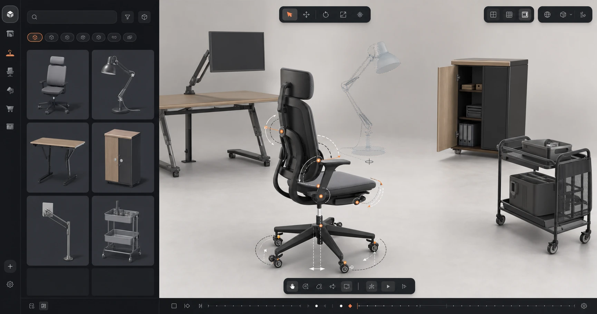

# Articraft for Pascal



A standalone reference plugin showing how to integrate Articraft with Pascal
Editor through the public Plugin API. It can browse a host-provided mirror of
Articraft-10K, place URDF assets as custom Pascal nodes, pose their
revolute/continuous/prismatic joints, and submit prompt or reference-image jobs
to a credentialed mini-articraft worker that returns posable USDZ.

This repository contains no private Pascal application source, deployment
configuration, project data, provider accounts, or credentials. The browser
plugin communicates only through the documented public plugin contracts and
same-origin host routes described below.

Placement previews use the same articulated URDF/USDZ hierarchy as committed
nodes, with translucent non-interactive materials and live articulation. New
placements keep that motion active after commit and after selection changes.
The inspector can stop or restart motion without writing per-frame joint values
into scene history or autosave. Automatic motion is paused when the operating
system requests reduced motion.

This is a Pascal integration maintained by `pascalorg`. It is not an official
hosted service from the Articraft researchers.

## What the plugin contributes

- Plugin id `pascal:articraft` and node kind `articraft:asset`.
- A lazy Articraft sidebar with Browse and Generate views. Generate exposes the
  worker's allowed model choices and keeps concurrent runs in a controllable queue;
  each card can restore its prompt/reference/model, stop active work, place a
  completed result, or be removed from the session list.
- A placement tool that persists the artifact identity, source attribution,
  normalized articulation graph, and current joint pose in the Pascal scene.
- URDF + OBJ rendering for the CC BY 4.0 Articraft-10K dataset.
- USDZ rendering for results produced by the Apache 2.0 mini-articraft SDK.
- Reactive Pascal appearance integration: Colored preserves authored materials,
  Solid swaps to cached Lambert variants, Monochrome follows the active furnishing
  palette and scene theme, and host-controlled shadows/edges/post-processing apply
  without plugin-specific quality toggles.
- Live position, rotation, scale, and joint controls in the Pascal inspector;
  radians stay radians in scene data and are displayed as degrees only for people.
- Persistent, selection-independent motion that smoothly sweeps every movable
  joint while keeping per-frame values transient.
- Native looping glTF animation clips for those articulated joints when a Pascal
  project is exported to GLB; the saved joint pose remains the file's rest pose.
- A registry-native 2D footprint that follows each asset's persisted position,
  yaw, scale, selection, and highlight state in floor-plan view.
- An optional reference studio backed by host-scoped Azure GPT Image 2 and Google
  Nano Banana 2 providers. Generated references are saved into Pascal Files before
  they are reused for articulated-asset generation.

The browser package never receives provider, worker, or Supabase service-role
credentials. Hosts expose the same-origin broker described in
[HOST_INTEGRATION.md](./HOST_INTEGRATION.md).

## Data and service boundaries

- Browsing calls the Pascal host's same-origin catalog route, then downloads
  model files from the public catalog storage origin configured by that host.
  That storage provider receives ordinary request metadata such as IP address
  and user agent.
- Generation sends the prompt, chosen allowlisted model, and optional reference image
  to the Pascal host. The worker publishes its configured default and selectable
  models through the credentialed broker; provider handling is governed by that
  provider's terms and the host operator's account.
- The reference worker persists the prompt, job status, and generated source/run
  metadata on its private durable volume. It publishes a normalized manifest
  without the prompt plus the public USDZ artifact. A reference image is kept only
  for the job and deleted locally when it finishes, although the selected model
  provider may retain inputs under its own policy.
- A placed Pascal node persists the catalog or generated artifact URL and
  digest, title, source attribution, optional generation prompt, dimensions,
  part/joint graph, transform, current joint pose, and whether motion is enabled.
  It does not persist a provider key, worker bearer token, Supabase service-role
  key, or Pascal user identity.

The plugin has no OAuth scopes or external account session. Report suspected
security issues privately by following [SECURITY.md](./SECURITY.md); use
[GitHub issues](https://github.com/pascalorg/plugin-articraft/issues) for public
support requests.

## Development

```bash
bun install
bun run build
bun run check-types
bun test

cd server
uv sync --extra test
uv run pytest
```

Read [Create a plugin](https://editor.pascal.app/docs/developers/plugins) for
Pascal's public Plugin API v1 contract.

Hosts consuming the reviewed Git source must transpile the raw TypeScript
entrypoint. `bun run build` emits a code-split ESM review artifact under ignored
`dist/`; no install-time script or network request is required.

## Upstream and data attribution

- [Articraft project](https://articraft3d.github.io/)
- [mini-articraft](https://github.com/articraftresearch/Articraft), Apache 2.0
- [Articraft-10K](https://huggingface.co/datasets/camvsl/Articraft-10K),
  CC BY 4.0, by the Articraft authors / Cambridge Visual Structure Learning Lab

Every mirrored catalog record keeps the upstream dataset revision, source
archive, license, and attribution. Applications embedding this plugin must keep
that attribution visible.

## License

Plugin and reference-worker integration code is MIT licensed. mini-articraft and
Articraft-10K retain their own licenses above; this repository does not relicense
their code or dataset artifacts.
